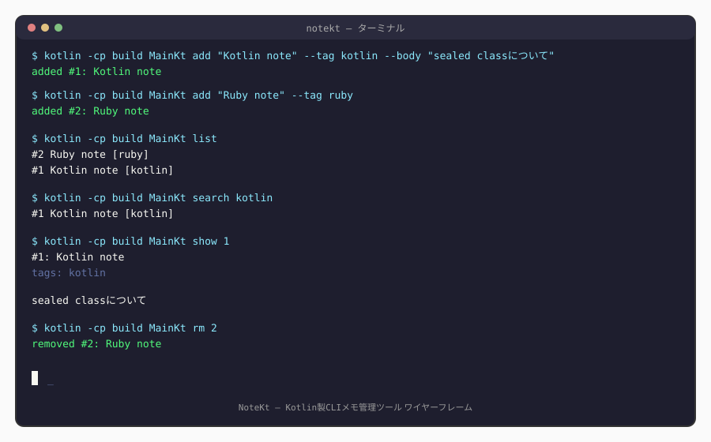
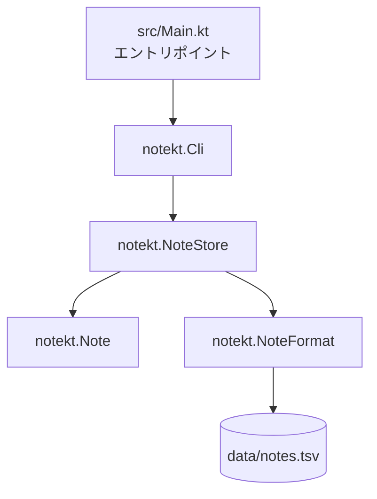
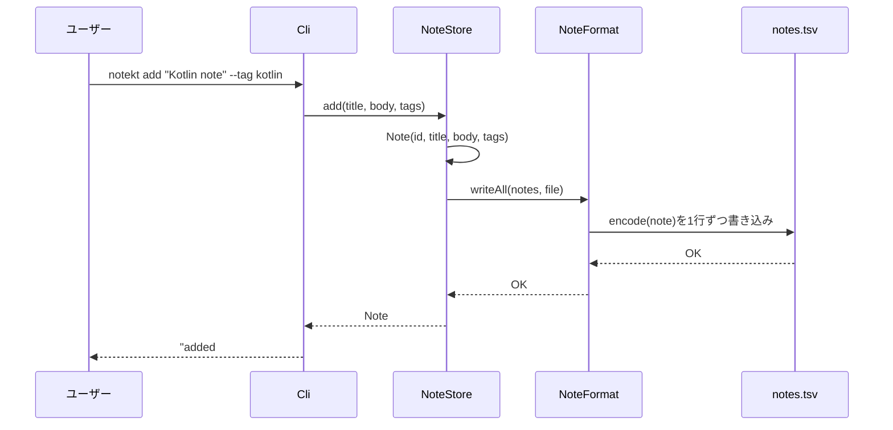

# NoteKt

コマンドラインで動く、シンプルなメモ管理CLI。


## 目次

* [概要](#概要)
* [特徴（主な機能）](#特徴主な機能)
* [想定ユーザー（ペルソナ）](#想定ユーザーペルソナ)
* [UIイメージ](#uiイメージ)
* [技術スタック](#技術スタック)
* [システム構成図](#システム構成図)
* [データ構造](#データ構造)
* [セットアップ](#セットアップ)
* [コマンド一覧](#コマンド一覧)
* [今後の展望](#今後の展望)

## 概要

NoteKtは、ターミナルから素早くメモを残し、キーワードやタグで検索できるCLIツールです。タイトル・本文・タグを指定して保存し、あとから全文検索できます。

Gradleは使わず、`kotlinc`（Kotlinコンパイラ本体）だけでビルドできる構成にしています。JDK標準ライブラリにJSONサポートが無く、`kotlinx.serialization`等の外部ライブラリも使わない方針のため、永続化にはNote専用の軽量なテキスト形式を自前で実装しています。テストもkotlin.test（JUnit依存）は使わず、これまでの言語と同じ自作アサーションハーネスで書いています。

## 特徴（主な機能）

- メモの追加（タイトル・本文・タグ）
- 一覧表示
- キーワード検索（タイトル・本文・タグを横断、大文字小文字を無視）
- タグでの絞り込み
- メモの詳細表示・削除
- タブ区切りテキストファイルへの永続化（`data/notes.tsv`）

## 想定ユーザー（ペルソナ）

思いついたことをすぐメモしたいが、Webアプリやスマホアプリを開く手間をかけたくない開発者・学習者を想定しています。ターミナルを離れずに「今考えていること」や「調べたこと」を記録し、あとからキーワードで探し出したい人に向いています。リッチテキストや画像添付、同期機能などは対象外です。

## UIイメージ



典型的な使用フロー（追加→一覧確認→検索→詳細表示）のターミナル出力イメージです。

## 技術スタック

| 分類 | 技術 |
| --- | --- |
| 言語 | Kotlin 1.9+ / JVM 17+ |
| ビルドツール | `kotlinc`（Gradle不使用） |
| 永続化 | タブ区切りテキストファイル（自作フォーマット、JSON不使用） |
| テスト | 自作アサーションハーネス（`test/notekt/test/TestHarness.kt`） |
| CI/CD | GitHub Actions（JDKは`actions/setup-java`、kotlincは公式リリースを直接取得） |
| 依存管理 | なし（外部ライブラリ・Gradleプラグイン不使用） |

## システム構成図





## データ構造

中心となるのは`Note`データクラスです。永続化は`NoteFormat`が担当し、JSONの代わりに以下の自作テキスト形式を使っています。

| プロパティ | 型 | 説明 |
| --- | --- | --- |
| `id` | `Int` | メモID（1から自動採番） |
| `title` | `String` | タイトル |
| `body` | `String` | 本文 |
| `tags` | `List<String>` | タグ（複数可） |
| `createdAt` | `Long` | 作成日時（エポックミリ秒） |

`data/notes.tsv`のフォーマット（1行1メモ、タブ区切り）:

```
id <TAB> escapedTitle <TAB> escapedBody <TAB> tag1,tag2,... <TAB> createdAt
```

タイトル・本文に含まれうるタブ・改行・バックスラッシュは、区切り文字と衝突しないようエスケープしてから書き込み、読み込み時に元に戻します（`NoteFormat.escape`/`unescape`）。

## セットアップ

JDK 17以上と、Kotlinコンパイラ(`kotlinc`)が必要です。Gradleは不要です。

```bash
# バージョン確認
java -version
kotlinc -version

# コンパイル(アプリ+テストをまとめてビルド)
kotlinc src test -d build

# アプリの実行
kotlin -cp build MainKt add "Buy milk" --tag home
kotlin -cp build MainKt list
```

保存先は`data/notes.tsv`です。環境変数`NOTEKT_DATA`でパスを変更できます。

### テストの実行

```bash
kotlin -cp build TestRunnerKt
```

全テストが成功すると`全テスト成功`と表示され、終了コード0で終わります（CIはこれを合否判定に使っています）。テストは一時ファイル（`File.createTempFile`）を使うため、`data/notes.tsv`には影響しません。

## コマンド一覧

| コマンド | 説明 | 主なオプション |
| --- | --- | --- |
| `add <タイトル>` | メモを追加 | `--body 本文`, `--tag タグ`（複数可） |
| `list` / `ls` | メモ一覧を表示 | なし |
| `search <キーワード>` | キーワードで検索 | `--tag タグ` |
| `show <id>` | メモの詳細（本文含む）を表示 | なし |
| `rm <id>` / `delete <id>` | メモを削除する | なし |
| `help` | 使い方を表示する | なし |

## 今後の展望

- メモ本文でのMarkdownレンダリング（ターミナル向け簡易表示）
- 更新日時の記録・編集機能（現状は作成のみで編集は削除→再作成の運用）
- 全文検索の高速化（現状は毎回全件を線形走査）
- エクスポート機能（Markdown/CSV）
- 複数ノートブック（カテゴリ）への対応

あくまで個人のローカル環境で完結するCLIツールという位置づけで、クラウド同期や共有機能は現時点では対象外です。
